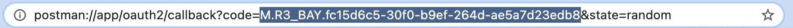
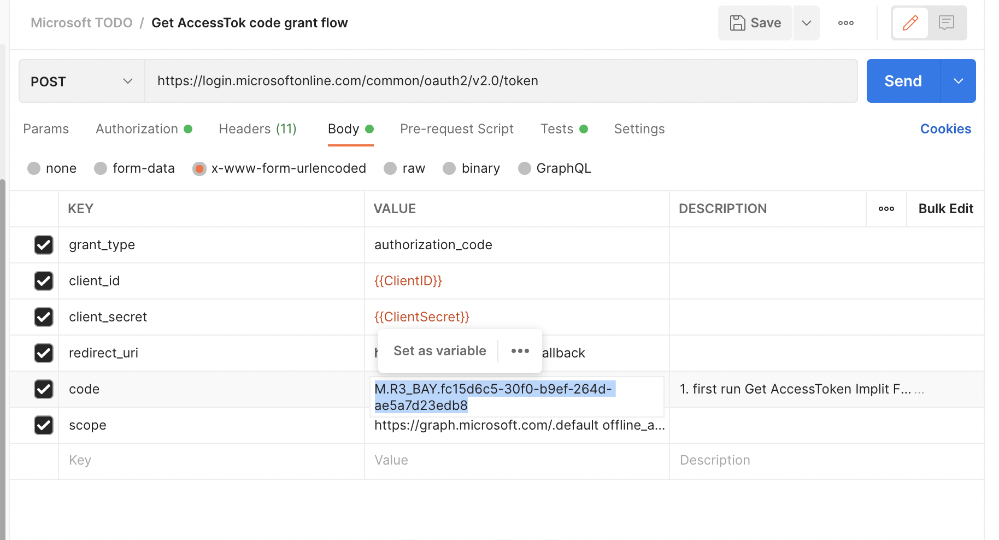
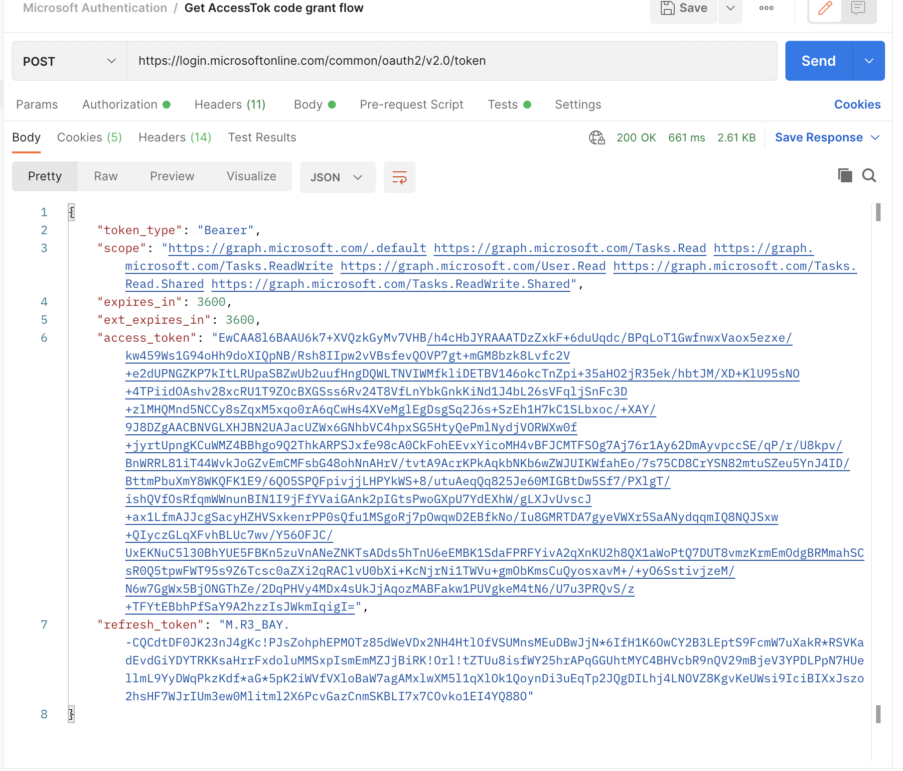
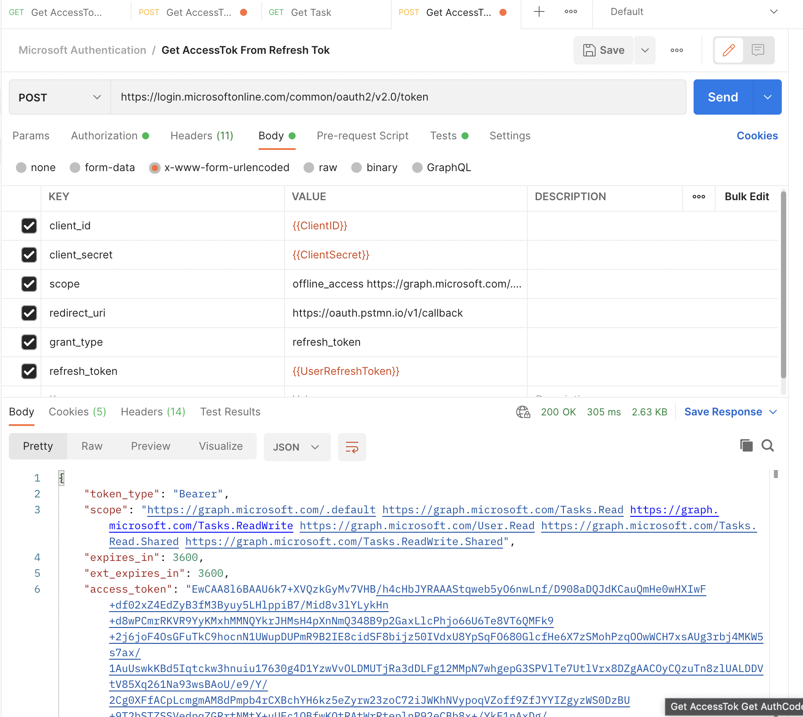

# Authenticate with Postman

- Run https://login.microsoftonline.com/common/oauth2/v2.0/authorize?client_id={{ClientID}}&scope=offline_access https://graph.microsoft.com/.default&redirect_uri=https://oauth.pstmn.io/v1/callback&response_type=code&response_mode=query&state=random in chrome or edge browser
- Retrieve `ClientID` from AAD

- Copy the `code` from browser into postman `code` parameter  
  


- Run POST `Get AccessTok code grant flow` query


```
redirect_uri: https://oauth.pstmn.io/v1/callback
scope: https://graph.microsoft.com/.default offline_access
```




NOTE: `*@microsoft.com` account won't work

- Example result




# Refresh token in postman
